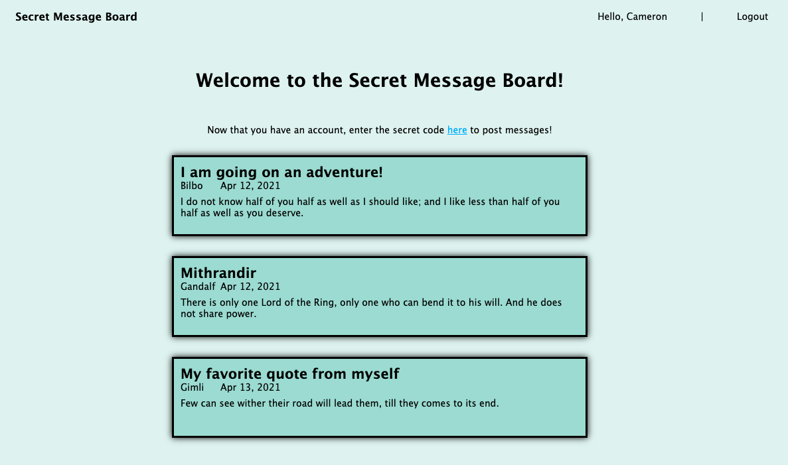

# members-only-node

A blog website that hides some information from unauthenticated users. It's main focus is to have users with permissions, as well as pages that dynamically display content, based on the users permission level.

    

## Features

- Uses Passport, Bcryptjs, Node, Express, Pug, SASS, Mongoose, and MongoDB.
- Hides post creator, time of post, and post creation process to unauthenticated users.
- Restricts post deletion to admins.

## Demo

- https://secure-oasis-30404.herokuapp.com/
